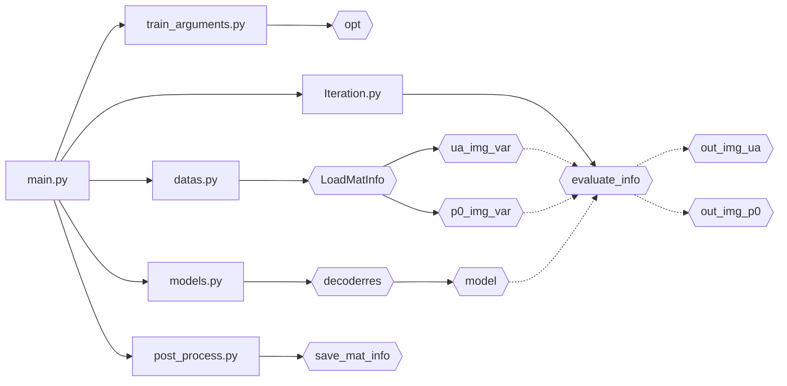

## [new]暂定按照迭代次数逐步提高光子包数量(1e8真的太费时间了！)

暂时添加了动态光子包数量调整，也就是现在是逐渐调整

- 1e5跑4次二维空间的 mcx
- 1e7跑4次接近立方体空间的 mcx

至少现在的速度，在刚开始的时候蒙特卡洛可以实时完成，比之前快了不少

主要相当于在iteration.py加入了nowtime_mcxinfo()传当前epoch对应的蒙特卡洛模拟信息(参数请去看函数)

然后，请先调整train_argument.py的训练次数

不过暂时遇到了一个问题，二维蒙卡和三维蒙卡还是差的太多了！

因此nowtime_mcxinfo中对于mcx_space开始使用三维模拟最好早一些开始，比如刚开始rate是0.2

## 按照迭代次数改变蒙特卡洛模拟空间

前60%的epoch是二维的，之后逐渐从二维变到之前那种三维立方体空间

添加在了Iteration.py里

并且为了观察方便，替换掉了原本的mcx输出

最后,记得调train_argument.py的训练次数 和 打印间隔

## 调整为二维蒙特卡洛模拟

这个添加了使用上次说的二维mcx训练，虽然还没完全改完(二维和三维修改需要改mcx_try_function.py里mcxtry函数传入的参数,[1,256,256]是2维的[256,256,256]和原来一样,暂时只能设置这俩, 之后的我再改改这几个文件,整合到train_argument.py里)，但是应该能用了(可能)

然后效果的话就是直接运行一下reconstruct/Iteration.py,算是正常跑的时候也会这么玩(跑完记得清理一下reconstruct/下的json和mc2,非强迫症可以忽略)

最后,记得调train_argument.py的训练次数

## 后面的话都可以忽略

## Photoacoustic_Decoder

- reconstruct是放主要实现代码的目录
- save已经学会自己创建了
- test_data 是作为输入的目录
- tools 是画图的，没有其他目录有任何依赖，无大用

大致的流程是这样的

## 一共进行两次训练，先预训练ua，再训练p0

- 获取opt、准备加载数据、实例化模型

#### 第一次计算

- 加载ua图像
- 第一次迭代
    - 根据目标图像(ua)的尺寸加载噪声
    - 设定优化器、损失函数、准备tensorboard
        - 进迭代
        - 噪声>模型>吸收系数(ua)
        - 损失计算反向传播优化器迭代
        - 收录信息
    - 保存模型
- 保存训练数据

#### 第二次计算

- 加载p0图像
- 第二次迭代
    - 根据目标图像(p0)的尺寸加载噪声
    - 设定优化器、损失函数、准备tensorboard
        - 进迭代
        - 噪声>模型>吸收系数(ua)
        - 吸收系数>蒙卡>声压(p0)
            - 抽5点监督
            - 变换加格式整理
            - mcxtry获得光通量
            - 切片取log
            - 计算初始声压
        - 损失计算反向传播优化器迭代
        - 收录信息
    - 保存模型
- 保存训练数据

