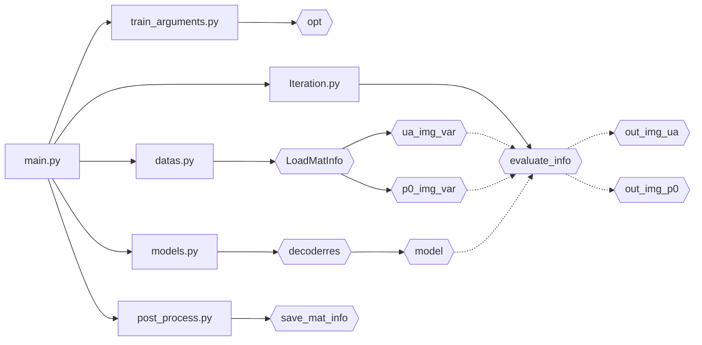

## Photoacoustic_Decoder

- reconstruct是放主要实现代码的目录
- save已经学会自己创建了
- test_data 是作为输入的目录
- tools 是画图的，没有其他目录有任何依赖，无大用

大致的流程是这样的

## 一共进行两次训练，先预训练ua，再训练p0

- 获取opt、准备加载数据、实例化模型

#### 第一次计算

- 加载ua图像
- 第一次迭代
    - 根据目标图像(ua)的尺寸加载噪声
    - 设定优化器、损失函数、准备tensorboard
        - 进迭代
        - 噪声>模型>吸收系数(ua)
        - 损失计算反向传播优化器迭代
        - 收录信息
    - 保存模型
- 保存训练数据

#### 第二次计算

- 加载p0图像
- 第二次迭代
    - 根据目标图像(p0)的尺寸加载噪声
    - 设定优化器、损失函数、准备tensorboard
        - 进迭代
        - 噪声>模型>吸收系数(ua)
        - 吸收系数>蒙卡>声压(p0)
            - 抽5点监督
            - 变换加格式整理
            - mcxtry获得光通量
            - 切片取log
            - 计算初始声压
        - 损失计算反向传播优化器迭代
        - 收录信息
    - 保存模型
- 保存训练数据

