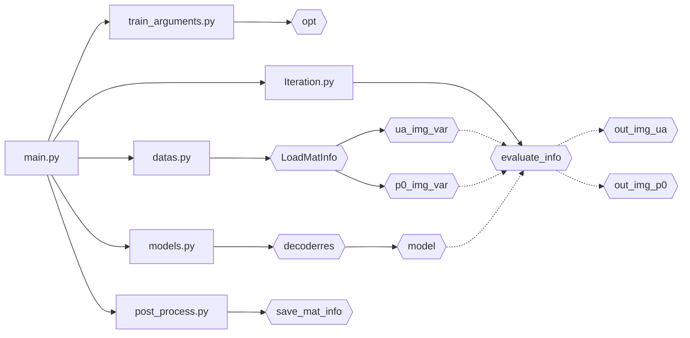

## [new] 从mcx调整到使用pmcx

#### 生活性调整

加载arguments与加载mat图像统一在load_info.py下，直接使用函数调用

添加了肺部组织使用例

更改load_net_input() 仅返回单个数组

适度调节蒙卡迭代参数控制

调整变量名称，增加设置model多次更新后才更新蒙卡

略调整输出图片

......

按照styleGAN的思路，我这个模型目前也很容易出现液滴伪影，那我是不是也可以把这货理解为解耦，然后加入adaIN？

## 简单补充预先的环境配置

### 准备mcx环境

首先进入mcx官网找到[夜间版](http://mcx.space/nightly/) 然后寻找自己需要的mcx环境，

注：夜间版相当于最新版(感谢qianqian fang的拼命内卷)

如果需要稳定版(虽然我个人感觉夜间版也很稳定了)请进入[这里](http://mcx.space/nightly/release/)

说一下不同后缀的区别，基本上每个大版本都有  # 这里以进入v2020版本为例

- MCX：相当于蒙特卡洛模拟的基础文件（这个对python很重要，不然无法运行）
- MCXLAB 相当于是mcx在matlab上的拓展《虽然对于这个项目来说大概率用不到》
- MCXStudio 相当于整合了MCX、MMC(另一个蒙特卡洛模拟工具) 的工具箱（其实不下MCX直接下这个也行）

因此选择下载 [mcx-win-x86_64-v2020.zip](http://mcx.space/nightly/release/v2020/mcx-win-x86_64-v2020.zip)并找好目录解压，随后把：

```
<unzip file path>/mcx/bin/
```

添加到环境变量，以保证在cmd可以正常调用mcx

### 准备conda环境

虽然但是还是用conda吧，打开prompt

```
conda create -n PAD python=3.8
conda actiavte PAD
```

environments.yaml之后再补，嗯

```
conda env create -f environment.yml
```

比较重要的：pytorch最好是1.8以上，准备好tensorboard

### 模拟训练

如果是作为测试：即预先设置已知的光学吸收系数，然后做仿体，再进入光学系统 （当然，您如果认为没必要可以直接使用kwave）得到重建的声压图像

那么在训练前可以选择启用 ua pre train 部分

相当于先使用ua拟合出一个预置的目标，再按照文章的（呃，希望明年能见刊）思路来进行正常训练

如果是正常训练，直接训练p0就可以（相对于没有预训练的来说，会多花一些epoch，大概一倍多？）

- 值得庆幸的是：目前这个无监督训练占用的显存很少
- 不值得庆幸的是：由于本身就是无监督，多设几个epoch也没什么用

## 暂定按照迭代次数逐步提高光子包数量(1e8真的太费时间了！)

暂时添加了动态光子包数量调整，也就是现在是逐渐调整

- 1e5跑4次二维空间的 mcx
- 1e7跑4次接近立方体空间的 mcx

至少现在的速度，在刚开始的时候蒙特卡洛可以实时完成，比之前快了不少

主要相当于在iteration.py加入了nowtime_mcxinfo()传当前epoch对应的蒙特卡洛模拟信息(参数请去看函数)

然后，请先调整train_argument.py的训练次数

不过暂时遇到了一个问题，二维蒙卡和三维蒙卡还是差的太多了！

因此nowtime_mcxinfo中对于mcx_space开始使用三维模拟最好早一些开始，比如刚开始rate是0.2


## 按照迭代次数改变蒙特卡洛模拟空间

前60%的epoch是二维的，之后逐渐从二维变到之前那种三维立方体空间

添加在了Iteration.py里

并且为了观察方便，替换掉了原本的mcx输出

最后,记得调train_argument.py的训练次数 和 打印间隔

## 调整为二维蒙特卡洛模拟

这个添加了使用上次说的二维mcx训练，虽然还没完全改完(二维和三维修改需要改mcx_try_function.py里mcxtry函数传入的参数,[1,256,256]是2维的[256,256,256]和原来一样,暂时只能设置这俩, 之后的我再改改这几个文件,整合到train_argument.py里)，但是应该能用了(可能)

然后效果的话就是直接运行一下reconstruct/Iteration.py,算是正常跑的时候也会这么玩(跑完记得清理一下reconstruct/下的json和mc2,非强迫症可以忽略)

最后,记得调train_argument.py的训练次数

## 后面的话都可以忽略

## Photoacoustic_Decoder

- reconstruct是放主要实现代码的目录
- save已经学会自己创建了
- test_data 是作为输入的目录
- tools 是画图的，没有其他目录有任何依赖，无大用

大致的流程是这样的



## 一共进行两次训练，先预训练ua，再训练p0

- 获取opt、准备加载数据、实例化模型

#### 第一次计算

- 加载ua图像
- 第一次迭代
    - 根据目标图像(ua)的尺寸加载噪声
    - 设定优化器、损失函数、准备tensorboard
        - 进迭代
        - 噪声>模型>吸收系数(ua)
        - 损失计算反向传播优化器迭代
        - 收录信息
    - 保存模型
- 保存训练数据

#### 第二次计算

- 加载p0图像
- 第二次迭代
    - 根据目标图像(p0)的尺寸加载噪声
    - 设定优化器、损失函数、准备tensorboard
        - 进迭代
        - 噪声>模型>吸收系数(ua)
        - 吸收系数>蒙卡>声压(p0)
            - 抽5点监督
            - 变换加格式整理
            - mcxtry获得光通量
            - 切片取log
            - 计算初始声压
        - 损失计算反向传播优化器迭代
        - 收录信息
    - 保存模型
- 保存训练数据


